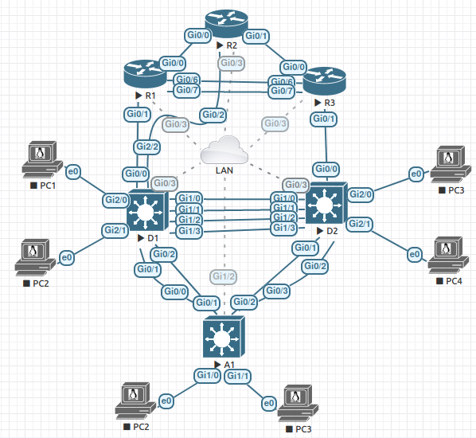

# CCNP ENARSI Lab Manual v8 Ansible Configuration



## Purpose

Hello Internet! While working through the [CCNP ENARSI Lab Manual](https://www.ciscopress.com/store/ccnp-enterprise-advanced-routing-enarsi-v8-lab-manual-9780136870937), I got pretty tired of having to reset the lab and reconfigure basic IP configurations on each device. That is how this little project started. That, and my curiouisty with messing with the new Cisco IOS collection. The goal of this repo is to help me or anyone out there working through the lab manual.

Long story short, and this will be a long story! This repo will help build the initial configurations for each device before starting a lab. Once the user completes the lab, there is also a destroy playbook to reset the lab. Side note, this repository is not a replacement for the lab manual. It is still required to go through the labs. This is only a complimentary tool, not a replacement. One more note, I did not use any official Cisco Network Academy training so I do not have access to the troubleshooting labs in the book. Maybe I'll add some troubleshootig labs later on if this gets popular :).

## Getting started

### Images Used

- IOSv Version 15.8(3)M2
- vios L2 Version 15.2

### Create Topology

Feel free to copy the topology I created above. Once that is done make sure each node has a connection to the same network as your Ansible control machine (light gray connections in the topology above).

### Node Connectivity

Once the nodes have all of their connections. The setup for all nodes is the same. Create MGMT VRF, assign management port to management VRF, and enable ssh. Below is a sample of the commands used on a Cisco device.

```python
hostname RTR1
ip domain name lab.com

vrf definition MGMT
 !
 address-family ipv4
 exit-address-family

username cisco privilege 15 password 0 cisco

interface GigabitEthernet0/3
 vrf forwarding MGMT
 ip address 192.168.10.119 255.255.255.0
 no shut

crypto key generate rsa 1024

ip route vrf MGMT 0.0.0.0 0.0.0.0 192.168.10.1

ip ssh ver 2

line vty 0 4
 login local
 transport input all
```

Feel free to modify the hosts file to match whatever IP schema you choose.

### Ansible Control Machine

This guide assumes you have some machine that can run Ansible and has connectivity to your nodes.

```bash
git clone https://github.com/JulioPDX/ccnp_enarsi_lab_manual.git
cd ccnp_enarsi_lab_manual
pip3 install -r requirements.txt
ansible-galaxy collection install cisco.ios 
```

## Project Structure

### Labs

Every lab has an individual folder for each node. This is used when running the playbook and loading in the correct variables.

```bash
labs/01_2.1.2/
├── A1.yaml
├── D1.yaml
├── D2.yaml
├── RTR1.yaml
├── RTR2.yaml
└── RTR3.yaml
```

Lets take a look at one of the node lab files.

```yaml
# From labs/14_16.1.2/RTR3.yaml

hostname: RTR3

interfaces:
  - name: GigabitEthernet0/0
    sub_int: False
    ipv4: 10.1.23.3/24
    ipv6: 2001:db8:acad:23::3/64
    link_local: fe80::23:3
  - name: GigabitEthernet0/1
    sub_int: False
    ipv4: 10.1.32.1/24
    ipv6: 2001:db8:acad:32::3/64
    link_local: fe80::32:3
  - name: Loopback0
    sub_int: False
    ipv4: 10.3.3.3/24
    ipv6: 2001:db8:acad:3::3/64
    link_local: fe80::3:3

destroy:
  eigrp:
    as: 
      - CISCO
```

The playbook will handle configuring the interfaces to match this vars file. There is also a `destroy` variable. Items defined in destroy will be removed from the devices after the user is done working through a lab. The interface that is attached to the MGMT VRF is not defined in these files for safety, if they are not included, then there is no chance the playbook or user may inadvertently reset the interface.

### Deploying

The deploy file is nothing too fancy. Its just calling out certain roles that will take care of the configuration. There is a simple assert at the beginining to make sure the user passes in a lab variable. This is where the individual lab folder comes in. When the user passes in the lab variable, Ansible will load the correct variable files to configure or destroy the nodes.

```yaml
# deploy.yaml
---
- name: Checking for valid lab definition
  hosts: localhost
  gather_facts: False
  tasks:
    - name: Check that lab is defined
      assert:
        that: lab is defined
        fail_msg: "no lab defined, please add extra vars defining lab variable"
        # Example ansible-playbook deploy.yaml -e lab=01_2.1.2

- name: CCNP ENARSI Lab Manual Switches
  hosts: switches #switches
  gather_facts: False
  strategy: free
  vars_files:
    - ./labs/{{ lab }}/{{ inventory_hostname }}.yaml
  roles:
  - role: banner
  - role: set_interfaces
  - role: vlans
    when: vlans is defined
  - role: sw_interfaces
  - role: static_routes
  - role: ospf_config
    when: ospf is defined
  - role: eigrp
    when: eigrp.ipv4 is defined
  - role: save_config
# snip
```

Most all of the roles for building the lab use the same structure. The task in the main.yaml file in each role kick off when certain conditions are met. To be honest, this is probably not the best way to handle this and I'm sure there's a more efficient method. Now is better than never and done is better than perfect.

```yaml
# ./roles/rtr_interfaces/tasks/main.yaml
- name: enable ipv6 routing on routers
  cisco.ios.ios_config:
    lines: ipv6 unicast-routing

- name: configure ipv4 L3 interfaces that are not sub interfaces
  cisco.ios.ios_l3_interfaces:
    config:
    - name: "{{ item.name }}"
      ipv4:
      - address: "{{ item.ipv4 }}"
  loop: "{{ interfaces }}"
  loop_control:
    label: "{{ item.name }}"
  when: "not item.sub_int and item.ipv4 is defined and 'Loopback' not in item.name"

- name: configure ipv6 L3 interfaces that are not sub interfaces
  cisco.ios.ios_l3_interfaces:
    config:
    - name: "{{ item.name }}"
      ipv6:
      - address: "{{ item.ipv6 }}"
  loop: "{{ interfaces }}"
  loop_control:
    label: "{{ item.name }}"
  when: "not item.sub_int and item.ipv6 is defined and 'Loopback' not in item.name"
# snip
```

The configuration portion for the most part has pretty specific roles. Each having a designated.... role :). Below I will give some overview on the destroy playbook.

### Destroying Lab

```yaml
# destroy.yaml
---
- name: Checking for valid lab definition
  hosts: localhost
  gather_facts: False
  tasks:
    - name: Check that lab is defined
      assert:
        that: lab is defined
        fail_msg: "no lab defined, please add extra vars defining lab variable"
        # Example ansible-playbook destroy.yaml -e lab=01_2.1.2

- name: reset switch layer 2 stuffs
  hosts: switches
  gather_facts: False
  strategy: free
  vars_files:
    - ./labs/{{ lab }}/{{ inventory_hostname }}.yaml
  roles:
  - destroy_lab
  - destroy_vlans
  - reset_reload

- name: Reset routers
  hosts: routers
  gather_facts: False
  strategy: free
  vars_files:
    - ./labs/{{ lab }}/{{ inventory_hostname }}.yaml
  roles:
  - destroy_lab
  # - reset_reload # Not working for IOSv Routers

  tasks:
    - name: save config before reload
      cisco.ios.ios_config:
        save_when: always
```

In the second playbook above, there is only one role called. But in actuality it is calling many reset files. This was mainly done for my sanity as the number of roles kept growing. I tried to make the destroy portion one small role... but that ended up growing either way. Anywho, below is a snip of the main.yaml file in the destroy_lab role.

```yaml
# main.yaml
- name: include reset_routing
  include: reset_routing.yaml

- name: include reset_static_routes
  include: reset_static_routes.yaml

- name: include reset_interfaces
  include: reset_interfaces.yaml

- name: include reset_dhcp
  include: reset_dhcp.yaml

- name: include reset_key_chains
  include: reset_key_chains.yaml

- name: include reset_route_maps
  include: reset_route_maps.yaml

- name: include reset_acl_prefix
  include: reset_acl_prefix.yaml

- name: include reset_policy
  include: reset_policy.yaml

- name: include reset_crypto
  include: reset_crypto.yaml

- name: include reset_vrf
  include: reset_vrf.yaml

- name: include reset_banner
  include: reset_banner.yaml
```

Below is the reset_routing task file that is called from the main.yaml file above

```yaml
# ./roles/destroy_lab/tasks/reset_routing.yaml
- name: delete eigrp process
  cisco.ios.ios_config:
    lines:
    - no router eigrp {{ item }}
  when: destroy.eigrp.as is defined
  loop: "{{ destroy.eigrp.as }}"

- name: delete classic IPv6 eigrp process
  cisco.ios.ios_config:
    lines:
    - no ipv6 router eigrp {{ item }}
  when: destroy.eigrp.ipv6.as is defined
  loop: "{{ destroy.eigrp.ipv6.as }}"

- name: delete all OSPFv2 processes
  cisco.ios.ios_ospfv2:
    state: deleted
  ignore_errors: yes

- name: delete all OSPFv3 processes
  cisco.ios.ios_ospfv3:
    state: deleted
  ignore_errors: yes

- name: delete bgp
  cisco.ios.ios_bgp:
    config:
      bgp_as: "{{ destroy.bgp.as }}"
    operation: delete
  when: destroy.bgp.as is defined
```

## Lab workflow

When creating this I worked through the book from front to back. Build lab, work through lab, and destroy lab once complete. The way this project was structured you can jump around between labs. As long as you reset the lab before moving on to the next.

### Lab Deploy Example

Here from the hub router perspective, none of the devices are configired, lab ask you to  begin with a confgired DMVPN phase3 that was complete from an earlier lab

[](https://asciinema.org/a/381759/?speed=2)

### Lab Destroy Example

Here from a spoke router perspective, we are viewing the interface and dmpvn configuiration and the entire lab will be reset

[](https://asciinema.org/a/scOYtR7cwyICkn9ABLH0WlznI/?speed=2)

## Caveats

- This is not a replacement for the official lab manual.
- This does not include the troubleshooting labs.
- When building a lab with sub interfaces, after running the destroy playbook. Please reboot the routers for stale subinterfaces to be removed from configuration.
